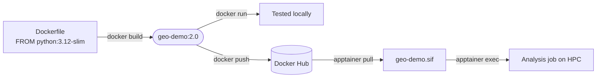

# Docker → Docker Hub → Apptainer/HPC

A live demo: run a scientific container, build a custom image on top of
it, ship it via Docker Hub, then run that same image on an HPC cluster
with no Docker involved at all.

---

## The pipeline



---

## 1. JupyterLab in the browser

`jupyter/scipy-notebook`: JupyterLab plus numpy, pandas, scipy, and
matplotlib, pre-installed.

```bash
docker run -d -p 8888:8888 -e JUPYTER_TOKEN=demo --name scipy-notebook jupyter/scipy-notebook:python-3.11.6
```

Open **http://localhost:8888/lab?token=demo**.

---

## 2. Build a custom image

`example/Dockerfile` builds a Python geospatial environment and adds
JupyterLab, `geopandas`, and `rasterio`:

```dockerfile
FROM python:3.12-slim

RUN pip install --no-cache-dir \
        jupyterlab geopandas rasterio

WORKDIR /home/analysis
COPY analysis.py .
CMD ["jupyter", "lab", "--ip=0.0.0.0", "--port=8888", "--no-browser", \
     "--allow-root", "--IdentityProvider.token=demo"]
```

```bash
cd example
docker build -t geo-demo:2.0 .
```

---

## 2. Run it interactively in JupyterLab

The image's `CMD` launches JupyterLab by default, no override needed:

```bash
docker run -d -p 8888:8888 --name geo-demo-jupyter geo-demo:2.0
```

Open **http://localhost:8888/lab?token=demo**. `analysis.py` is right
there in the file browser (served from `/home/analysis`); open it and
run it interactively to see the buffer output.

---

## 3. Push to Docker Hub

```bash
docker login
docker tag geo-demo:2.0 tdevereux/geo-demo:2.0
docker push tdevereux/geo-demo:2.0
```

---

## 4. Pull and run on HPC with Apptainer

On the HPC login node: no Docker needed, just Apptainer. Pass the
script explicitly since the image's default `CMD` (JupyterLab) never
exits:

```bash
apptainer pull geo-demo.sif docker://tdevereux/geo-demo:2.0
apptainer exec --bind /scratch/$USER:/output geo-demo.sif python3 analysis.py
```

---

## Same image, same output

No daemon and no root, anywhere on the cluster.

Full primer with explanations: [README.md](README.md)
