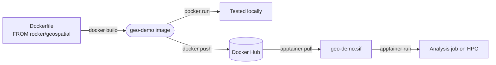

# Demo: Docker → Docker Hub → Apptainer/HPC

A four-step live demo: run a scientific container with RStudio in the
browser, build your own image on top of it, ship it via Docker Hub, then
run that same image on an HPC cluster with no Docker involved at all.



## 1. RStudio Server in the browser

`rocker/geospatial` ships RStudio Server — R plus the geospatial stack
(`sf`, `terra`, GDAL, GEOS, PROJ), pre-built.

```bash
docker run -d -p 8787:8787 -e PASSWORD=demo --name rstudio-geo rocker/geospatial
```

Open **http://localhost:8787** — log in with user `rstudio`, password
`demo`.

```bash
docker stop rstudio-geo && docker rm rstudio-geo
```

## 2. Build a custom image

[`example/Dockerfile`](example/Dockerfile) builds on `rocker/geospatial`
and adds Python:

```dockerfile
FROM rocker/geospatial:latest

RUN apt-get update && apt-get install -y --no-install-recommends \
        python3 python3-venv \
    && rm -rf /var/lib/apt/lists/*
RUN python3 -m venv /opt/venv
ENV PATH="/opt/venv/bin:${PATH}"
RUN pip install --no-cache-dir geopandas rasterio

WORKDIR /home/analysis
COPY analysis.R .
CMD ["Rscript", "analysis.R"]
```

```bash
cd example
docker build -t geo-demo .
mkdir -p output
docker run --rm -v $(pwd)/output:/output geo-demo
```

## 3. Push to Docker Hub

```bash
docker login
docker tag geo-demo:latest tdevereux/geo-demo:latest
docker push tdevereux/geo-demo:latest
```

## 4. Pull and run on HPC with Apptainer

On the HPC login node — no Docker needed here, just Apptainer:

```bash
apptainer pull geo-demo.sif docker://tdevereux/geo-demo:latest
apptainer run --bind /scratch/$USER:/output geo-demo.sif
```

Same image, same output, no daemon and no root anywhere on the cluster.

---
Full primer with explanations: [README.md](README.md)
