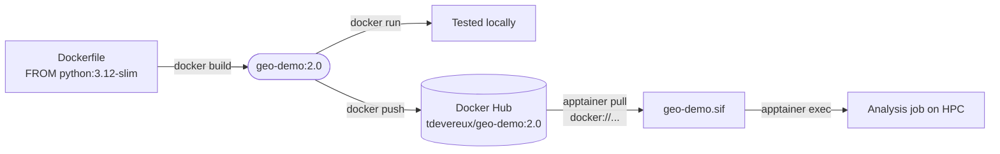
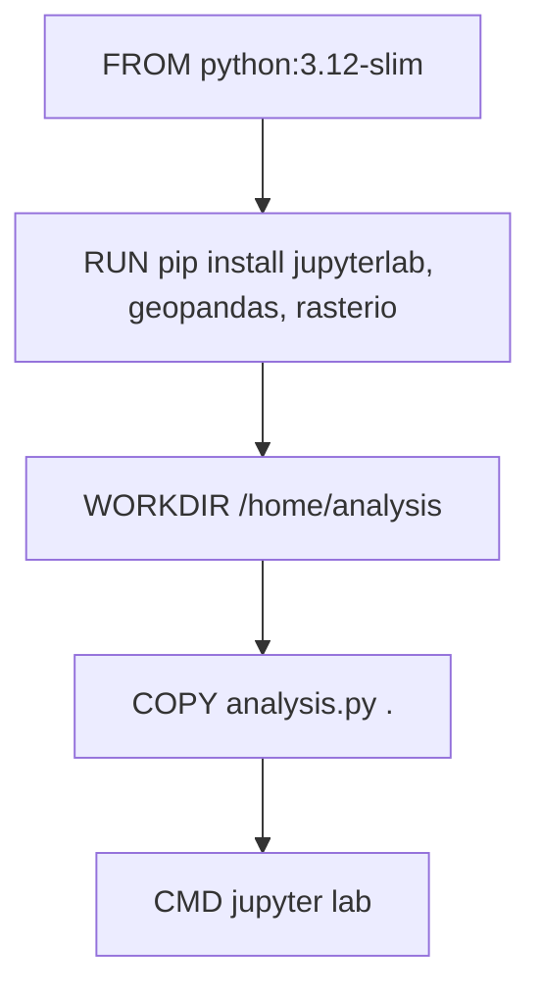

# Docker Basics for Scientific Computing

A short, hands-on primer on containers for research workflows: what they
are, the core commands, how to build your own image around a scientific
base image, and how to run that same image on an HPC cluster with
Apptainer (Singularity).

Why containers matter for research: they pin down the OS, compiler
toolchain, and library versions (GDAL, GEOS, PROJ, Python package
versions, ...) that your analysis depends on, so a collaborator, or you
in six months, can reproduce a result exactly, and a cluster job doesn't
silently break because a shared library changed underneath it.

The end-to-end path this repo walks through: build on a laptop, ship via
Docker Hub, run on a cluster with no Docker involved at all:



## 1. Images vs. Containers

- **Image**: a read-only template (filesystem + metadata) that describes
  what should run: an OS layer, your code, dependencies, and a default
  command. Built once, reused everywhere.
- **Container**: a running (or stopped) *instance* of an image. It's an
  isolated process with its own filesystem, network, and process tree,
  but it shares the host's kernel (this is why containers start in
  milliseconds, unlike VMs).

Think of an image like a class, and a container like an object created
from it: you can run many containers from the same image, e.g. one per
sample in a batch analysis.


## 2. Install & sanity check

Install Docker Desktop (Mac/Windows) or Docker Engine (Linux). Then:

```bash
docker version    # confirms client + daemon are talking
docker run hello-world
```

If `hello-world` prints a welcome message, Docker pulled an image and
ran it as a container successfully.

(On a shared HPC cluster you typically won't have Docker at all. See
[§9, Apptainer](#9-running-on-hpc-with-apptainersingularity) for how the
same image runs there.)

## 3. Core commands

| Command | What it does |
|---|---|
| `docker images` | List images stored locally |
| `docker ps` | List *running* containers |
| `docker ps -a` | List all containers (including stopped) |
| `docker pull <image>` | Download an image from a registry (default: Docker Hub) |
| `docker run <image>` | Create + start a container from an image |
| `docker run -d <image>` | Run detached (in the background) |
| `docker run -v $(pwd):/data <image>` | Mount a local data directory into the container |
| `docker exec -it <container> bash` | Open a shell inside a running container |
| `docker logs <container>` | View a container's stdout/stderr |
| `docker stop <container>` | Gracefully stop a running container |
| `docker rm <container>` | Delete a stopped container |
| `docker rmi <image>` | Delete an image |
| `docker build -t <name> .` | Build an image from a Dockerfile in the current directory |

Containers and images are referenced by name or ID; both work.

## 4. Try it: run an existing scientific image

[Jupyter Docker Stacks](https://jupyter-docker-stacks.readthedocs.io/)
publishes ready-made Python data science images, including
`jupyter/scipy-notebook`: JupyterLab plus numpy, pandas, scipy, and
matplotlib, pre-installed.

```bash
docker run -d -p 8888:8888 -e JUPYTER_TOKEN=demo --name scipy-notebook jupyter/scipy-notebook:python-3.11.6
```

Open **http://localhost:8888/lab?token=demo** in a browser to get a
full JupyterLab session with no setup. Note the tag: this particular
image family on Docker Hub hasn't been updated since 2023 (new Jupyter
Docker Stacks builds moved to a different registry), which is exactly
why pinning a specific tag instead of `:latest` matters: it still
behaves exactly as documented years later.

```bash
docker stop scipy-notebook && docker rm scipy-notebook
```

## 5. The Dockerfile

A `Dockerfile` is the recipe for building your own image *on top of* a
base image. This repo's [`example/`](example/) directory builds a
general-purpose Python geospatial research environment from a plain
Python base, rather than a large pre-built stack, and ships a small
script just to prove the environment works:

```dockerfile
FROM python:3.12-slim

LABEL maintainer="tdevereux" \
      description="General-purpose Python geospatial research environment"

RUN pip install --no-cache-dir \
        jupyterlab \
        geopandas \
        rasterio

WORKDIR /home/analysis
COPY analysis.py .

CMD ["jupyter", "lab", "--ip=0.0.0.0", "--port=8888", "--no-browser", \
     "--allow-root", "--IdentityProvider.token=demo"]
```

Common instructions:

- `FROM`: base image to build on top of. Always pin a specific tag
  (this repo uses `python:3.12-slim`); avoid `:latest`, since it
  silently moves to a new Python version whenever the base image is
  rebuilt
- `LABEL`: attach metadata (maintainer, description) to the image
- `RUN`: execute a command *while building* the image. This is how
  you add software: `apt-get install` for system packages, `pip
  install` for Python packages
- `WORKDIR`: sets the current directory for subsequent instructions
- `COPY` / `ADD`: copy files from your machine into the image
- `CMD`: the default command run when a container starts if you don't
  pass one; here it launches JupyterLab, so `docker run` gives you an
  interactive session by default, with the batch script available as
  an explicit override

```bash
docker run --rm geo-demo:2.0 python3 analysis.py
```

Each instruction becomes a cached layer. Docker only re-runs an
instruction (and everything below it) if it or something above it
changed, which is why slow steps like package installs should sit
*above* frequently-changed steps like copying your script:



### Editing the Dockerfile

Say you also want the `pygbif` package (a Python client for pulling
species occurrence data from GBIF) available in the environment. Edit
`example/Dockerfile`:

```dockerfile
FROM python:3.12-slim

LABEL maintainer="tdevereux" \
      description="General-purpose Python geospatial research environment"

RUN pip install --no-cache-dir \
        jupyterlab \
        geopandas \
        rasterio \
        pygbif

WORKDIR /home/analysis
COPY analysis.py .

CMD ["jupyter", "lab", "--ip=0.0.0.0", "--port=8888", "--no-browser", \
     "--allow-root", "--IdentityProvider.token=demo"]
```

Then rebuild. Docker caches unchanged layers, so only the new/changed
instructions (and everything below them) re-run:

```bash
cd example
docker build -t geo-demo:2.0 .
```

### Run it as a batch script

```bash
cd example
docker build -t geo-demo:2.0 .
mkdir -p output
docker run --rm -v $(pwd)/output:/output geo-demo:2.0 python3 analysis.py
cat output/buffer.geojson
```

The script buffers a point (UQ St Lucia campus) by 1 km using
`geopandas`/`shapely` and writes the result to `/output`, which is
bind-mounted to your local `output/` directory so the file persists
after the container exits. The buffer distance is read from an
environment variable with a default, so it can be changed at run time
with no rebuild:

```bash
docker run --rm -e BUFFER_DIST_M=500 -v $(pwd)/output:/output geo-demo:2.0 python3 analysis.py
```

### Run it interactively in JupyterLab instead

Run the image with no command override to get its `CMD` (JupyterLab on
port 8888), using this same custom image with `geopandas`/`rasterio`
already installed:

```bash
docker run -d -p 8888:8888 --name geo-demo-jupyter geo-demo:2.0
```

Open **http://localhost:8888/lab?token=demo**. `analysis.py` is served
from `/home/analysis`, which is JupyterLab's working directory, so it's
right there in the file browser: open it, or paste its contents into a
new notebook cell, and run interactively. `docker exec -it
geo-demo-jupyter bash` also gets you a plain shell in the same
environment, if you'd rather work from a terminal.

## 6. Volumes (persisting and sharing data)

Containers are ephemeral: delete the container and its filesystem
changes are gone. For research data, you almost always want a **bind
mount** to your host (or cluster) filesystem rather than data living
only inside the container:

```bash
docker run -v $(pwd)/data:/data -v $(pwd)/output:/output geo-demo:2.0 python3 analysis.py
```

Named volumes (`docker volume create my-data`) are useful for things
Docker itself should manage, like a database's files, but for input
datasets and analysis outputs, a bind mount to a path you control is
usually simpler and more transparent.

## 7. Networking basics

Relevant if your workflow involves a database or API alongside your
analysis container (e.g. PostGIS):

```bash
docker network create my-net
docker run --network my-net --name postgis-db postgis/postgis
docker run --network my-net --name analysis geo-demo:2.0 python3 analysis.py   # can reach 'postgis-db' by name
```

For a single batch-analysis container like this repo's example,
networking usually isn't needed at all.

## 8. Cleaning up

```bash
docker ps -a                 # see everything, including stopped containers
docker container prune       # remove all stopped containers
docker image prune           # remove dangling (untagged) images
docker system prune          # remove unused containers, networks, images
```

Scientific base images (geospatial, bioinformatics, ML) can be several
GB, so pruning matters more here than with typical web-app images.

## 9. Running on HPC with Apptainer/Singularity

Shared clusters generally don't allow the Docker daemon (it requires
root). [Apptainer](https://apptainer.org/) (formerly Singularity) runs
OCI/Docker-format containers without a daemon and without root, which is
why it's the standard container runtime on HPC systems.

### Pull straight from Docker Hub

You don't need Docker at all for this: Apptainer can pull and convert
a Docker Hub image directly into its own single-file `.sif` format:

```bash
apptainer pull scipy.sif docker://jupyter/scipy-notebook:python-3.11.6
apptainer exec scipy.sif python3 -c "import pandas; print(pandas.__version__)"
```

### Push your own image, then pull it on the cluster

The typical workflow: build and test locally (§5), push to Docker Hub,
then on the HPC login node (which usually has Apptainer but not
Docker) pull straight from the registry.

On your dev machine:

```bash
docker login
docker tag geo-demo:2.0 <your-dockerhub-user>/geo-demo:2.0
docker push <your-dockerhub-user>/geo-demo:2.0
```

On the HPC login node (no Docker needed here at all):

```bash
apptainer pull geo-demo.sif docker://<your-dockerhub-user>/geo-demo:2.0
```

This was tested end-to-end as `docker.io/tdevereux/geo-demo:2.0`.
`apptainer pull` fetches the OCI image layers directly from Docker Hub
and converts them into a single `.sif` file, no daemon involved on
either end. Note the explicit version tag: an untagged `docker build`
or `docker push` defaults to `:latest`, which is exactly the moving
target this whole section is avoiding.

If Docker *is* available where you're building and you'd rather skip
the registry round-trip, you can convert a local image directly:

```bash
apptainer build geo-demo.sif docker-daemon://geo-demo:2.0
```

### Run it

The image has no `CMD` override applied by default; running the `.sif`
inherits the image's `CMD`, which launches JupyterLab and never exits.
That's fine for local interactive use, but on HPC there's no browser to
connect to and no reason to leave a server process running, so always
pass the script explicitly with `apptainer exec` rather than
`apptainer run`:

```bash
mkdir -p output
apptainer exec --bind $(pwd)/output:/output geo-demo.sif python3 analysis.py
```

Key differences from Docker, in practice:

- No daemon, no root: `apptainer` runs as your own user, which is why
  clusters allow it.
- An image is a single `.sif` file, easy to `scp`/`rsync` to a cluster
  or reference in a Slurm script.
- Your home directory and current working directory are bind-mounted
  automatically; use `--bind host_path:container_path` for anything
  else (like `/output` above).
- Containers are read-only by default (`--writable` needed to change
  that), which fits the "immutable environment, mutable data" model
  most analyses want.

A typical Slurm job step just calls:

```bash
apptainer exec --bind /scratch/$USER:/output geo-demo.sif python3 analysis.py
```

## Next steps

- Modify `example/analysis.py`: try a different `geopandas`/`rasterio`
  operation on your own shapefile or raster, then rebuild and re-run to
  see the change take effect.
- Pin the base image to a specific Python patch version (e.g.
  `python:3.12.7-slim`) once you need long-term reproducibility.
- Build the image once, convert to `.sif`, and reuse it across every
  cluster job in a batch; that's the main payoff versus installing
  packages fresh on each node.
- Read up on multi-stage builds once you're comfortable: they keep
  images smaller by separating build-time and run-time dependencies.
