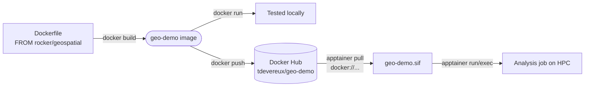
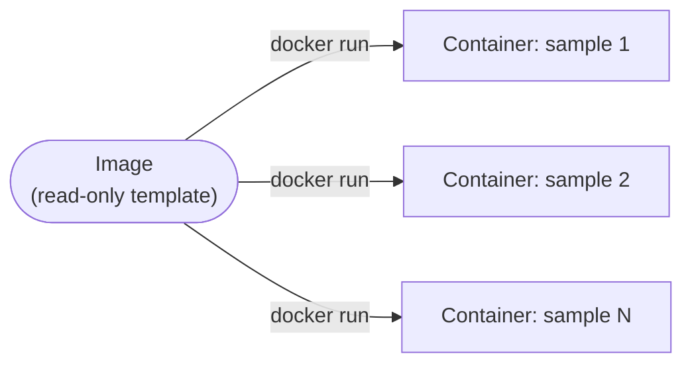
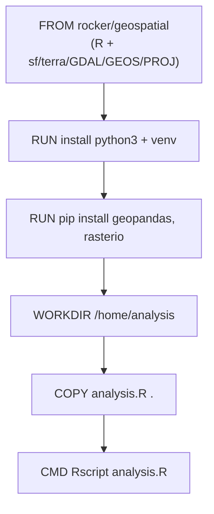

# Docker Basics for Scientific Computing

A short, hands-on primer on containers for research workflows: what they
are, the core commands, how to build your own image around a scientific
base image, and how to run that same image on an HPC cluster with
Apptainer (Singularity).

Why containers matter for research: they pin down the OS, compiler
toolchain, and library versions (GDAL, GEOS, PROJ, R/Python package
versions, ...) that your analysis depends on, so a collaborator — or you,
in six months — can reproduce a result exactly, and a cluster job doesn't
silently break because a shared library changed underneath it.

The end-to-end path this repo walks through — build on a laptop, ship via
Docker Hub, run on a cluster with no Docker involved at all:



## 1. Images vs. Containers

- **Image** — a read-only template (filesystem + metadata) that describes
  what should run: an OS layer, your code, dependencies, and a default
  command. Built once, reused everywhere.
- **Container** — a running (or stopped) *instance* of an image. It's an
  isolated process with its own filesystem, network, and process tree,
  but it shares the host's kernel (this is why containers start in
  milliseconds, unlike VMs).

Think of an image like a class, and a container like an object created
from it — you can run many containers from the same image, e.g. one per
sample in a batch analysis.



## 2. Install & sanity check

Install Docker Desktop (Mac/Windows) or Docker Engine (Linux). Then:

```bash
docker version    # confirms client + daemon are talking
docker run hello-world
```

If `hello-world` prints a welcome message, Docker pulled an image and
ran it as a container successfully.

(On a shared HPC cluster you typically won't have Docker at all — see
[§9, Apptainer](#9-running-on-hpc-with-apptainersingularity) for how the
same image runs there.)

## 3. Core commands

| Command | What it does |
|---|---|
| `docker images` | List images stored locally |
| `docker ps` | List *running* containers |
| `docker ps -a` | List all containers (including stopped) |
| `docker pull <image>` | Download an image from a registry (default: Docker Hub) |
| `docker run <image>` | Create + start a container from an image |
| `docker run -d <image>` | Run detached (in the background) |
| `docker run -v $(pwd):/data <image>` | Mount a local data directory into the container |
| `docker exec -it <container> bash` | Open a shell inside a running container |
| `docker logs <container>` | View a container's stdout/stderr |
| `docker stop <container>` | Gracefully stop a running container |
| `docker rm <container>` | Delete a stopped container |
| `docker rmi <image>` | Delete an image |
| `docker build -t <name> .` | Build an image from a Dockerfile in the current directory |

Containers and images are referenced by name or ID — both work.

## 4. Try it: run an existing scientific image

The [Rocker Project](https://rocker-project.org/) publishes ready-made R
images on Docker Hub, including `rocker/geospatial` — R plus the
spatial stack (`sf`, `terra`, `stars`, GDAL, GEOS, PROJ) all
pre-compiled, so you skip the usual multi-hour build of geospatial
system libraries.

```bash
docker run -it --rm rocker/geospatial R -e 'library(sf); sf_extSoftVersion()'
```

This pulls the image (first run only), starts R inside the container,
prints the GDAL/GEOS/PROJ versions baked into it, and removes the
container afterward (`--rm`) since we don't need to keep it around.

### RStudio Server in the browser

`rocker/geospatial` is built on `rocker/rstudio`, so it ships RStudio
Server — a full RStudio IDE served over HTTP, useful for interactive
exploration before you commit an analysis to a script:

```bash
docker run -d -p 8787:8787 -e PASSWORD=<choose-a-password> --name rstudio-geo rocker/geospatial
```

Open **http://localhost:8787** in a browser. Log in with user `rstudio`
and the password you set.

> **WSL2 note:** if `localhost:8787` doesn't load in a Windows browser,
> it's usually a double-NAT issue with the container's rootless
> networking not being visible to WSL2's own localhost-forwarding.
> Rerun with `--network host` instead of `-p 8787:8787` — that binds
> the port directly in the WSL2 VM's network namespace, which Windows
> can reach normally:
> ```bash
> docker run -d --network host -e PASSWORD=<password> --name rstudio-geo rocker/geospatial
> ```

Stop it when done: `docker stop rstudio-geo && docker rm rstudio-geo`.

## 5. The Dockerfile

A `Dockerfile` is the recipe for building your own image *on top of* a
base image. This repo's [`example/`](example/) directory builds on
`rocker/geospatial` to make a general-purpose R + Python research
environment — not tied to one analysis — and ships a small `sf` script
just to prove the environment works:

```dockerfile
FROM rocker/geospatial:latest   # base image: R + sf/terra/GDAL/GEOS/PROJ

LABEL maintainer="tdevereux" \
      description="General-purpose R + Python geospatial research environment"

# Add Python alongside R, plus a couple of common geospatial packages —
# installed into a venv so they don't clash with the OS's own Python.
RUN apt-get update && apt-get install -y --no-install-recommends \
        python3 \
        python3-venv \
    && rm -rf /var/lib/apt/lists/*

RUN python3 -m venv /opt/venv
ENV PATH="/opt/venv/bin:${PATH}"

RUN pip install --no-cache-dir \
        geopandas \
        rasterio

WORKDIR /home/analysis           # working directory inside the image
COPY analysis.R .                # copy your analysis script in

CMD ["Rscript", "analysis.R"]     # default command when a container starts
```

Common instructions:

- `FROM` — base image to build on top of (pin a tag, e.g.
  `rocker/geospatial:4.4.1`, once you need reproducibility over time —
  `:latest` will drift)
- `LABEL` — attach metadata (maintainer, description) to the image
- `RUN` — execute a command *while building* the image — this is how
  you add software: `apt-get install` for system packages, `pip
  install` / `install2.r` for language packages
- `ENV` — set an environment variable baked into the image (here,
  putting the venv first on `PATH` so `python3`/`pip` resolve to it)
- `WORKDIR` — sets the current directory for subsequent instructions
- `COPY` / `ADD` — copy files from your machine into the image
- `CMD` — the default command run when a container starts (easy to
  override per-container: `docker run geo-demo python3 script.py`)

Because the image now has both R and Python, either can be used per
container without rebuilding:

```bash
docker run --rm geo-demo Rscript analysis.R
docker run --rm geo-demo python3 -c "import geopandas; print(geopandas.__version__)"
```

Each instruction becomes a cached layer — Docker only re-runs an
instruction (and everything below it) if it or something above it
changed, which is why slow steps like package installs should sit
*above* frequently-changed steps like copying your script:



### Editing the Dockerfile

Say you also want the `rgbif` R package (for pulling species occurrence
data) available in the environment. Edit `example/Dockerfile`, adding
one line after the existing `FROM`:

```dockerfile
FROM rocker/geospatial:latest

LABEL maintainer="tdevereux" \
      description="General-purpose R + Python geospatial research environment"

RUN install2.r --error rgbif    # add an R package not in the base image

RUN apt-get update && apt-get install -y --no-install-recommends \
        python3 \
        python3-venv \
    && rm -rf /var/lib/apt/lists/*

RUN python3 -m venv /opt/venv
ENV PATH="/opt/venv/bin:${PATH}"

RUN pip install --no-cache-dir \
        geopandas \
        rasterio

WORKDIR /home/analysis
COPY analysis.R .

CMD ["Rscript", "analysis.R"]
```

Then rebuild — Docker caches unchanged layers, so only the new/changed
instructions (and everything below them) re-run:

```bash
cd example
docker build -t geo-demo .
```

### Build and run the example

```bash
cd example
docker build -t geo-demo .
mkdir -p output
docker run --rm -v $(pwd)/output:/output geo-demo
cat output/buffer.geojson
```

The script buffers a point by 1 km using `sf` and writes the result to
`/output`, which is bind-mounted to your local `output/` directory so
the file persists after the container exits. The buffer distance is
read from an environment variable with a default, so it can be changed
at run time with no rebuild:

```bash
docker run --rm -e BUFFER_DIST_M=500 -v $(pwd)/output:/output geo-demo
```

## 6. Volumes (persisting and sharing data)

Containers are ephemeral — delete the container and its filesystem
changes are gone. For research data, you almost always want a **bind
mount** to your host (or cluster) filesystem rather than data living
only inside the container:

```bash
docker run -v $(pwd)/data:/data -v $(pwd)/output:/output geo-demo
```

Named volumes (`docker volume create my-data`) are useful for things
Docker itself should manage, like a database's files, but for input
datasets and analysis outputs, a bind mount to a path you control is
usually simpler and more transparent.

## 7. Networking basics

Relevant if your workflow involves a database or API alongside your
analysis container (e.g. PostGIS):

```bash
docker network create my-net
docker run --network my-net --name postgis-db postgis/postgis
docker run --network my-net --name analysis geo-demo   # can reach 'postgis-db' by name
```

For a single batch-analysis container like this repo's example,
networking usually isn't needed at all.

## 8. Cleaning up

```bash
docker ps -a                 # see everything, including stopped containers
docker container prune       # remove all stopped containers
docker image prune           # remove dangling (untagged) images
docker system prune          # remove unused containers, networks, images
```

Scientific base images (geospatial, bioinformatics, ML) can be several
GB, so pruning matters more here than with typical web-app images.

## 9. Running on HPC with Apptainer/Singularity

Shared clusters generally don't allow the Docker daemon (it requires
root). [Apptainer](https://apptainer.org/) (formerly Singularity) runs
OCI/Docker-format containers without a daemon and without root, which is
why it's the standard container runtime on HPC systems.

### Pull straight from Docker Hub

You don't need Docker at all for this — Apptainer can pull and convert
a Docker Hub image directly into its own single-file `.sif` format:

```bash
apptainer pull geospatial.sif docker://rocker/geospatial:latest
apptainer exec geospatial.sif R -e 'library(sf); sf_extSoftVersion()'
```

### Push your own image, then pull it on the cluster

The typical workflow: build and test locally (§5), push to Docker Hub,
then on the HPC login node — which usually has Apptainer but not
Docker — pull straight from the registry.

On your dev machine:

```bash
docker login
docker tag geo-demo:latest <your-dockerhub-user>/geo-demo:latest
docker push <your-dockerhub-user>/geo-demo:latest
```

On the HPC login node (no Docker needed here at all):

```bash
apptainer pull geo-demo.sif docker://<your-dockerhub-user>/geo-demo:latest
```

This was tested end-to-end as `docker.io/tdevereux/geo-demo:latest` —
`apptainer pull` fetches the OCI image layers directly from Docker Hub
and converts them into a single `.sif` file, no daemon involved on
either end.

If Docker *is* available where you're building and you'd rather skip
the registry round-trip, you can convert a local image directly:

```bash
apptainer build geo-demo.sif docker-daemon://geo-demo:latest
```

### Run it

```bash
mkdir -p output
apptainer run --bind $(pwd)/output:/output geo-demo.sif
# or, to override the default command:
apptainer exec --bind $(pwd)/output:/output geo-demo.sif Rscript analysis.R
```

Key differences from Docker, in practice:

- No daemon, no root — `apptainer` runs as your own user, which is why
  clusters allow it.
- An image is a single `.sif` file — easy to `scp`/`rsync` to a cluster
  or reference in a Slurm script.
- Your home directory and current working directory are bind-mounted
  automatically; use `--bind host_path:container_path` for anything
  else (like `/output` above).
- Containers are read-only by default (`--writable` needed to change
  that), which fits the "immutable environment, mutable data" model
  most analyses want.

A typical Slurm job step just calls:

```bash
apptainer exec --bind /scratch/$USER:/output geo-demo.sif Rscript analysis.R
```

## Next steps

- Modify `example/analysis.R` — try a different `sf`/`terra` operation
  on your own shapefile or raster — then rebuild and re-run to see the
  change take effect.
- Pin the base image to a specific Rocker tag (e.g.
  `rocker/geospatial:4.4.1`) once you need long-term reproducibility.
- Build the image once, convert to `.sif`, and reuse it across every
  cluster job in a batch — that's the main payoff versus installing R
  packages fresh on each node.
- Read up on multi-stage builds once you're comfortable — they keep
  images smaller by separating build-time and run-time dependencies.
